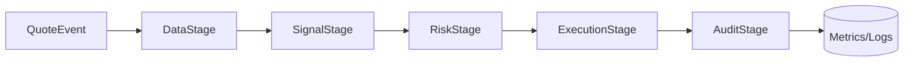

# futu-quant-trader

Production-ready Python algorithmic trading framework for Futu/Futubull OpenAPI.

## Architecture



## Prerequisites

- Python 3.11+
- Poetry
- Futu OpenD gateway
- Futu paper trading account

## Quick start (Docker Compose)

```bash
docker compose up --build
```

## Configuration reference

- `opend`: gateway host/port, heartbeat/reconnect, rate-limit
- `trading`: account, symbols, limits, cooldown
- `model`: model type/path/hot-reload/threshold
- `pipeline`: queue and feature window sizing
- `logging` and `metrics`: JSON log and Prometheus settings

See `/config/config.*.yaml`.

## Run backtests locally

```bash
python scripts/run_backtest.py --config config/config.staging.yaml
```

## Train a model

CLI:
```bash
python -m futu_trader.model.trainer --model mean_reversion --symbols 700.HK
```
GitHub Actions: run `Model Train` workflow manually.

## Paper trading validation

```bash
python -m futu_trader --mode paper --duration 3600
```

## Production deployment

Use `deploy-prod.yml` workflow with environment approval to build and deploy image.

## Observability

- Prometheus metrics: queue depth, throughput, dropped signals
- Grafana dashboard template: `docs/grafana_dashboard.json`

## Risk disclaimer

Trading involves substantial risk of loss. Use paper trading and staged deployment before any live capital deployment. Ensure compliance with local laws and broker terms.
