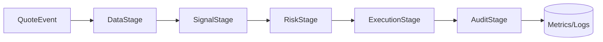

# futu-quant-trader

Production-ready Python algorithmic trading framework for Futu/Futubull OpenAPI.

## Architecture


```mermaid
flowchart LR
  Q[QuoteEvent] --> D[DataStage]
  D --> S[SignalStage]
  S --> R[RiskStage]
  R --> E[ExecutionStage]
  E --> A[AuditStage]
  A --> M[(Metrics/Logs)]
```

## Prerequisites

- Python 3.12+
- Poetry
- Futu OpenD gateway
- Futu paper trading account

## Quick start

### 1. Environment setup

```bash
cp .env.example .env
# Edit .env and set FUTU_ACCOUNT_ID
```

### 2. Docker Compose

```bash
docker compose up --build
```

### 3. Local development

```bash
conda activate futunn  # or your Python 3.12+ environment
poetry install --with dev
```

## Configuration

Configuration files live under `config/` (`config.dev.yaml`, `config.staging.yaml`, `config.prod.yaml`).

`${ENV}` placeholders (e.g. `${FUTU_ACCOUNT_ID}`) are resolved at runtime via `os.environ`.

| Section     | Purpose                                     |
|-------------|---------------------------------------------|
| `opend`     | Gateway host/port, heartbeat, reconnect, rate-limit |
| `trading`   | Account, symbols, limits, cooldown          |
| `model`     | Model type/path/hot-reload/threshold        |
| `pipeline`  | Queue and feature window sizing             |
| `logging`   | JSON log output and rotation                |
| `metrics`   | Prometheus metrics port                     |

## Run backtests

```bash
PYTHONPATH=src python scripts/run_backtest.py
```

> **Note:** `run_backtest.py` currently runs `Backtester().run([])` regardless of CLI arguments.

## Train a model

```bash
PYTHONPATH=src python -m trader.model.trainer --model mean_reversion --symbols 700.HK
```

GitHub Actions: run `Model Train` workflow manually.

## Paper trading

```bash
PYTHONPATH=src python -m trader --mode paper --duration 60
```

Requires Futu OpenD gateway at `127.0.0.1:11111`. Without it, the client falls back to paper mode automatically.

## Production deployment

Use `deploy-prod.yml` workflow with environment approval to build and deploy the Docker image.

## Observability

- Prometheus metrics: queue depth, throughput, stage-level counters
- Grafana dashboard template: `docs/grafana_dashboard.json`

## Risk disclaimer

Trading involves substantial risk of loss. Use paper trading and staged deployment before any live capital deployment. Ensure compliance with local laws and broker terms.

## Development

```bash
ruff check src/ tests/
ruff format --check .
mypy src
PYTHONPATH=src pytest tests/unit tests/integration --cov=src/trader --cov-report=xml --cov-fail-under=64
```

## Documentation

- `docs/architecture.md` — pipeline stages, factory, models, risk gates, data flow
- `docs/api-reference.md` — public classes, methods, and typed payloads
- `docs/runbook.md` — operations, health checks, troubleshooting
- `AGENTS.md` — contributor/agent commands and repo conventions
