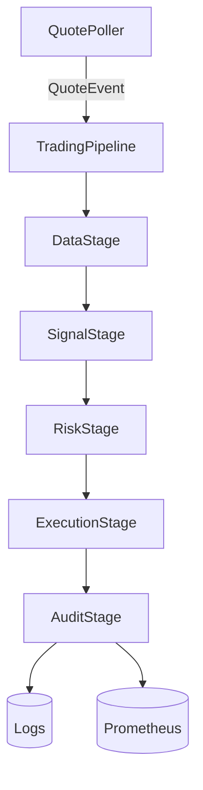

# Architecture

## Overview

Event-driven asyncio pipeline for automated trading on the Futu/Futubull OpenAPI.

## Pipeline stages

| Stage | Input | Output | Responsibility |
|-------|-------|--------|----------------|
| `DataStage` | `QuoteEvent` | Feature-enriched DataFrame | Rolling z-score, technical indicators via `DataNormalizer` |
| `SignalStage` | DataFrame | `Prediction` or `None` | Model inference (`ISignalModel`), confidence threshold gate |
| `RiskStage` | `Prediction` | Approved order or `None` | `RiskEngine` hard-gate checks + `KellyCriterion` sizing |
| `ExecutionStage` | Approved order | `OrderResponse` | `OrderManager` idempotent order placement |
| `AuditStage` | `OrderResponse` | None | Bounded event buffer, structured logging |

## Factory pattern

`DefaultPipelineFactory` (`src/trader/pipeline/factory.py`) builds all stages from `AppConfig` and `FutuClient`. Implement `IPipelineFactory` to create custom stage configurations.

## Models

All models implement `ISignalModel` (`src/trader/model/base.py`):

- **MeanReversionModel** — z-score threshold rules (default, wired into factory)
- **GradientBoostingModel** — scikit-learn `GradientBoostingClassifier`
- **LSTMModel** — PyTorch LSTM classifier
- **TransformerPriceModel** — Transformer encoder for price prediction

## Risk engine

`RiskEngine` (`src/trader/risk/risk_engine.py`) enforces hard gates under a 1ms latency budget:

- Per-symbol notional limit
- Portfolio-wide notional limit
- Daily loss limit
- Max open orders
- Concentration limit (% of portfolio)
- Zero portfolio value check

`KellyCriterion` (`src/trader/risk/kelly_criterion.py`) computes fractional Kelly position sizing.

## API client

`FutuClient` (`src/trader/api/client.py`) wraps Futu OpenD with:

- Async context manager lifecycle
- Bounded reconnect with exponential backoff + jitter
- Token-bucket rate limiting
- Heartbeat loop
- Automatic paper-mode fallback when gateway is unavailable

## Data flow

1. `QuotePoller` polls quotes at a configurable interval, emits `QuoteEvent` into the pipeline queue
2. `DataStage` enriches raw quotes with technical indicators (RSI, MACD, Bollinger, VWAP, OBV, z-score, lag features)
3. `SignalStage` runs model inference and gates on confidence threshold
4. `RiskStage` evaluates risk hard-gates and sizes the position via Kelly criterion
5. `ExecutionStage` places the order through `OrderManager`
6. `AuditStage` logs the event and updates Prometheus counters
