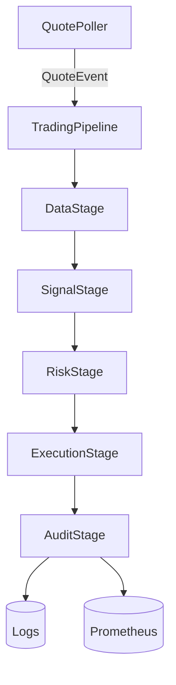

# Architecture

## Overview

Event-driven asyncio pipeline for automated trading on the Futu/Futubull OpenAPI.

## Pipeline stages

| Stage | Input | Output | Responsibility |
|-------|-------|--------|----------------|
| `DataStage` | `QuoteEvent` | `FeatureWindow` | Per-symbol rolling price windows; computes z-score, momentum, EMA trend strength, volatility, RSI, Bollinger-band position, price acceleration |
| `SignalStage` | `FeatureWindow` | `TradeSignal` or `None` | Model inference (`ISignalModel`), confidence threshold gate, per-symbol cooldown |
| `RiskStage` | `TradeSignal` | `ApprovedOrder` or `None` | `RiskEngine` hard-gate checks + `KellyCriterion` sizing scaled by signal confidence |
| `ExecutionStage` | `ApprovedOrder` | `OrderReceipt` | `OrderManager` idempotent order placement |
| `AuditStage` | `OrderReceipt` | `None` | Bounded event buffer, structured logging |

All stages implement `IStage[InputT, OutputT]` (`src/trader/pipeline/base.py`). The
`TradingPipeline` worker runs them sequentially per event and records Prometheus
throughput per stage plus queue depth.

## Factory pattern

`DefaultPipelineFactory` (`src/trader/pipeline/factory.py`) builds all stages from `AppConfig` and `FutuClient`. Implement `IPipelineFactory` to create custom stage configurations.

Model selection is a registry (`_model_builders`) keyed by `model.type` from config:

- `mean_reversion` (default) — `MeanReversionModel`
- `ensemble` — weighted `EnsembleSignalModel` of three mean-reversion variants
- `gradient_boosting` — lazy scikit-learn import, falls back to `mean_reversion` when unavailable

## Models

Models implement `ISignalModel` (`src/trader/model/base.py`):

- **MeanReversionModel** — z-score threshold rules with momentum confirmation (default, wired into factory)
- **EnsembleSignalModel** — weighted voting across member models with per-member error isolation
- **GradientBoostingModel** — scikit-learn `GradientBoostingClassifier` (optional dependency)
- **TransformerPriceModel** — Transformer encoder for price prediction (optional dependency)
- **LSTMModel** — PyTorch network scaffold; does not implement `ISignalModel` yet and is not wired into the factory

## Feature engineering

`DataNormalizer` (`src/trader/data/normalizer.py`) is a stateless batch helper for
training/backtest frames: RSI-14, MACD, Bollinger Bands, VWAP, OBV, log return,
realized volatility, z-score, and close lags. Live per-quote features come from
`DataStage`, which maintains its own rolling windows.

## Risk engine

`RiskEngine` (`src/trader/risk/risk_engine.py`) enforces ordered hard gates under a 1ms latency budget; the first failing gate decides the rejection reason:

1. Per-symbol notional limit
2. Portfolio-wide notional limit
3. Daily loss limit
4. Max open orders
5. Zero portfolio value check
6. Concentration limit (% of portfolio)
7. Latency budget exceeded

`KellyCriterion` (`src/trader/risk/kelly_criterion.py`) computes fractional Kelly position sizing; `RiskStage` scales it by signal confidence (≥0.85 → full, ≥0.70 → 60%, below → 30%).

## API client

`FutuClient` (`src/trader/api/client.py`) wraps Futu OpenD with:

- Async context manager lifecycle
- Bounded reconnect with exponential backoff + jitter
- Token-bucket rate limiting
- Heartbeat loop
- Automatic paper-mode fallback when gateway is unavailable (simulated quotes, orders, and portfolio)

## Data flow

1. `QuotePoller` polls quotes at a configurable interval, emits `QuoteEvent` into the pipeline queue
2. `DataStage` enriches the quote with rolling-window features (z-score, momentum, trend strength, volatility, RSI, Bollinger position, acceleration)
3. `SignalStage` runs model inference and gates on confidence threshold and cooldown
4. `RiskStage` evaluates risk hard-gates and sizes the position via Kelly criterion
5. `ExecutionStage` places the order through `OrderManager`
6. `AuditStage` logs the event and updates Prometheus counters
